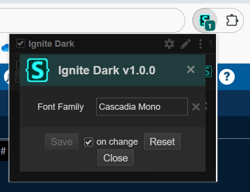
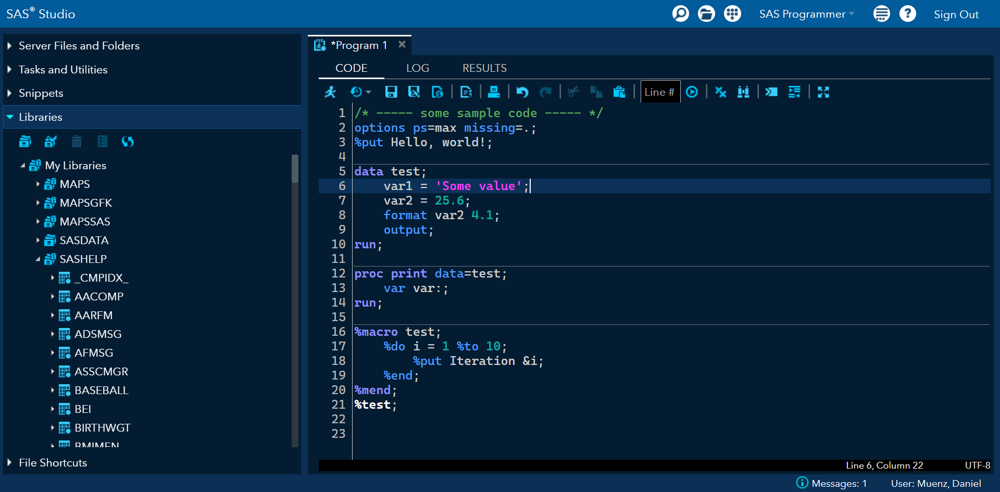

# Custom themes for SAS Studio 3

SAS Studio version 3 has a bright white theme with no built-in options to customize it. E.g., there is no dark theme. This repository provides CSS (Cascading Style Sheets) files to change the theme, including colors and the font of the code editor. These themes have been tested in SAS Studio 3.8 and 3.82.

## Installation

To use, first install the [Stylus browser extension](https://github.com/openstyles/stylus), available for Chrome, Edge (via Chrome), and Firefox. Then click a link below to install one of the themes. You can install more than one theme and toggle between them as desired.

📦 [Install *Ignite Dark*](https://raw.githubusercontent.com/dmuenz/sas-studio3-themes/master/ignite-dark.user.css)

## Changing the font of the code editor

To change the font for SAS code, load up SAS Studio. In your browser's toolbar, click the extension icon, then click the "Stylus" extension. A little pop-up window should appear with a list of the themes you have installed. Click the gear icon next to a theme, and a new window will pop up:

  

In the text box, type the name of any font available on your computer. If you leave the text box blank, SAS Studio will use its default font. Note that the custom CSS disables ligatures, so ligatures will not be used even if your font has them.

Note that SAS Studio has a built-in method to change the font *size*: In SAS Studio, go to Preferences -> Code and Log, then find the "Font size" drop-down menu.

## Screenshots

* Ignite Dark
  
  
  

